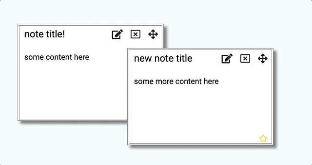
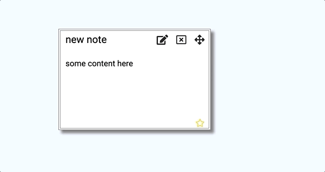
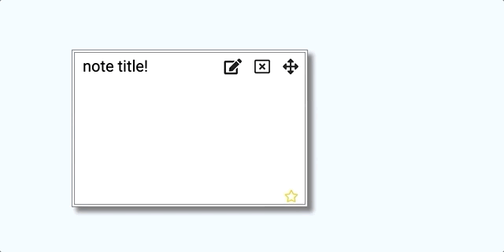

# Lab 3 
## React Notes – Avery Vanacore 

__What I did:__

For lab 3, I used React to create a realtime collaborative notes app.  When users land on this page, they can create a new  note by typing in the desired title for the note and clicking submit.  Each new note will be created in the top left corner of the page and will be draggable, resizable, editable, and deletable.  To clear the entire notepad, the user can click "Clear All" in the top right corner of the page.  My notes app has three components: the main App component (in index.js), the input bar where you add a new note (in add_note.js) and the note component (in note.js).  The app employs Firebase so that editing occurs in realtime and all updates are based on Firebase events.  I added three fields to the notes Map() provided in the instructions (width, height, starred) to add more functionality to the note.

I used the code provided in the instructions to help structure my own code.  Additionally, the following articles helped me better understand React and Firebase.

* <https://reactjs.org/docs/thinking-in-react.html>
* <https://firebase.google.com/docs/database/web/read-and-write>

__What worked:__

I completed all the minimal functional specs, as well as Markdown support.  I also attempted some extra credit (explained below). When I began this lab, I truthfully did not understand this.props and this.state; however, after completing this lab, I now have a better grasp on these conceptual details of React.  

__What didn't work:__

Though the app is functional, there are some conceptual and syntax aspects of this lab that I still don't fully understand.  Though I implemented callback functions in Part 2, I still don't conceptually understand the point of these functions/what happens when you implement one.  Additionally, I wanted to add a method of note organization such as show-all and wanted my star button to re-color the entire note (not just a bar at the bottom of the note) but had difficulty figuring out how to implement CSS with jQuery as we had in lab 2.

__Extra credit attempted:__

1. To deal with zIndex sorting, I created a global variable maxZIndex in my Note component and set it to 0.  I defined a method { this.onStartDrag } that increments the maxZIndex and sets the current note's zIndex to the maxZIndex.  Therefore, a note will pop to the front when it is dragged.

2. I used a component that I found online, re-resizable, to make the notes resizable.  As the x and y position of the top-left corner of the note are set, the note can be resized by pulling on its right side, bottom right corner, or bottom side.

3. I'm not sure if these count as extra credit, but I added the delete all button that deletes all the notes from the page, as well as a star on the bottom of each note that allows you to mark whether or not a note is important.

